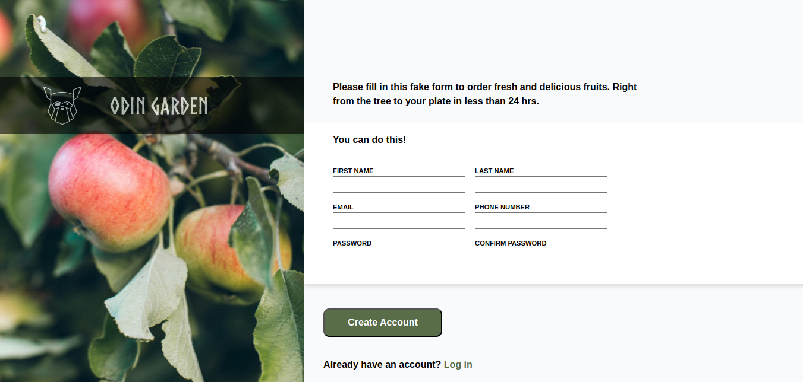

## This is my submission for the 'Sign-up Form' project in the Intermediate HTML and CSS on The Odin Project. 

### Solution Links

- Solution URL: [https://github.com/vipinsharmaa/Odin-Sign-up-Form](https://github.com/vipinsharmaa/Odin-Sign-up-Form)
- Live Site URL: [https://vipinsharmaa.github.io/Odin-Sign-up-Form/](https://vipinsharmaa.github.io/Odin-Sign-up-Form/)

### Screenshot

### Built with

- Semantic HTML5 markup
- Flexbox

## Authors

- Twitter - [@codecrash007](https://www.twitter.com/codecrash007)
- GitHub  - [@vipinsharmaa](https://github.com/vipinsharmaa)

### Attributions: 

Image by  Anna Kaminova  https://unsplash.com/@annakaminova